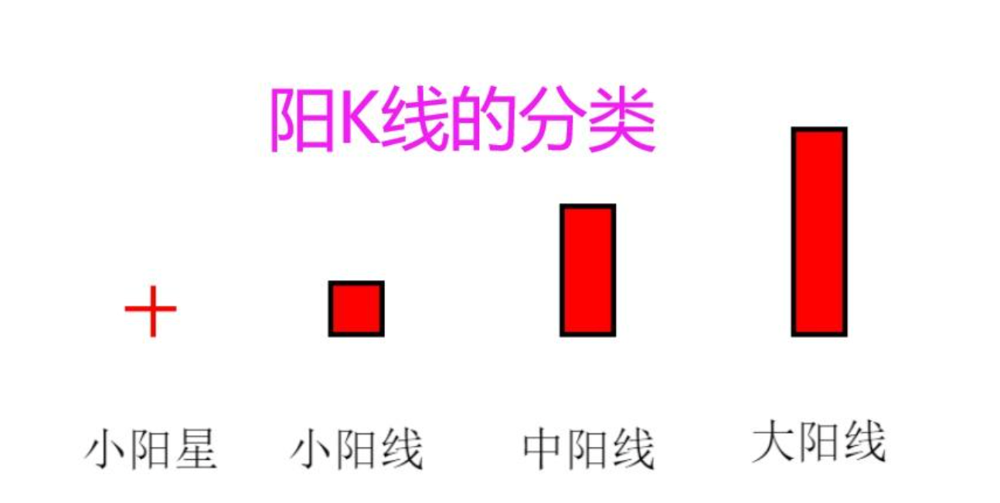
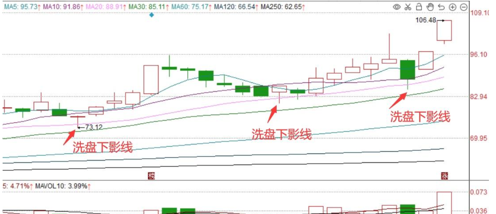

10 日线均势回踩确认模型

## **一、环境过滤**

满足其中 2 条即可：

1. 上证指数 未连续 2 天放量下跌

2. 当天涨跌家数接近或大于 1:1

3. 无明显系统性利空

4. 不满足 → 当天不做任何新开仓

## 二、股票筛选

个股筛选（盘后完成）

只看 8 个条件：判断 “跌不动”，不是“刚开始跌”。

1. 股价在 5-50 元区间
2. 收盘价在 20 日均线之上（多头趋势）
3. 最近 3-8 天有回调（跌幅 > 5% 或连续阴线），但不破 MA20
4. 回调期间成交量缩小（< 回调前的 70%）
5. 日成交额 >= 1 亿元
6. 当天 K 线为小阳线或带下影线
7. 非连续涨停股（最近 10 日涨停次数 < 3）
8. 排除科创板，创业板，北交所， ST， 选择沪深主板

<!--more-->

## 三、仓位管理

    单只股票：不超过总资金的 20%～30%
    •	同时持仓：最多 2～3 只
    •	永远留 30% 现金

## 四、买入执行（次日完成）

买入条件（同时满足）：

1. 股价仍在 MA20 上方
2. 回调已持续 3 ～ 8 天
3. 最低价没有有效跌破 MA20
4. 最近 1 ～ 2 天出现以下之一：
   • 小阳线
   • 十字星
   • 下影线 ≥ 实体的 1 倍
5. 当天成交量 ≤ 回调前平均成交量的 70%

买入方式：
• 次日开盘后 30 分钟内，价格不破前一日最低价
• 市价 / 接近开盘价买入

## 五、卖点规则

### 1. 止损（绝对规则）

1. 收盘价有效跌破 MA20
2. 买入后 最大亏损达到 -7%
3. 出现放量大阴线（成交量 ≥ 前 5 日 1.5 倍）

### 2. 止盈规则

    •	股价 连续拉升
    •	收盘价距离 MA20 ≥ +12%～15%

👉 分两次卖出：
• 第一次：卖 50%
• 剩余部分用 MA20 跟踪止盈

## 六、图形特征

### 1. 什么是小阳线 (Small Bullish Candle)？

形态特征：收盘价略高于开盘价。在 K 线图中，实体部分（柱子）较短，颜色通常为红色（中国股市）或绿色（欧美股市）。

涨幅范围：通常指涨幅在 0.5% ~ 1.5% 左右（并没有严格标准，主要看实体相对大小）。

市场含义：

多方占优：当天的买盘力量略微胜过卖盘，但优势并不巨大。

蓄势或盘整：如果连续出现小阳线，可能意味着主力在缓慢吸筹，或者市场正在休整，等待方向选择。

### 2. 什么是下影线 (Lower Shadow)？

形态特征：K 线实体下方的那根细线。

形成过程：开盘后，股价曾经跌到了很低的位置，但随后有买盘涌入，把价格推了回去，收盘时价格高于最低价。

市场含义：

下方有支撑：说明在那个低价位，有人愿意买入（抄底），或者卖方力量衰竭。

拒绝下跌：下影线越长，说明下方的支撑力量越强，“探底回升”的意味越浓。

